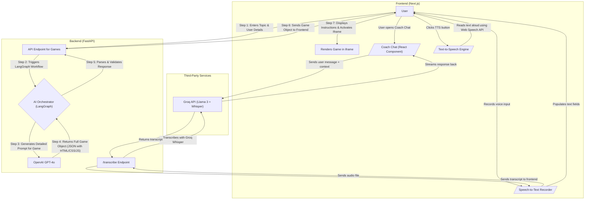

# 🎮 EMPOWER: AI-Powered Adaptive Learning Games

**Empower** is a revolutionary web platform that leverages cutting-edge AI to generate educational mini-games for children. Our mission is to provide a truly personalized learning experience by dynamically creating games that adapt to each child's age, learning goals, and specific disability needs.

This project moves beyond static, one-size-fits-all educational content. By generating games on-the-spot, we can create highly engaging, relevant, and accessible learning tools for any topic imaginable.

## 📜 Table of Contents

- [✨ Key Innovations](#-key-innovations)
- [🛠️ Tech Stack](#️-tech-stack)
- [🏛️ Architecture](#️-architecture)
- [📂 Project Structure](#-project-structure)
- [🚀 Getting Started](#-getting-started)
- [⚙️ How It Works](#️-how-it-works)
- [🔧 Customization](#-customization)
- [🗺️ Roadmap](#️-roadmap)
- [🤝 Contributing](#-contributing)
- [📄 License](#-license)

## ✨ Key Innovations

-   **Zero-Template Game Generation**: Games are created entirely by AI from a single prompt, allowing for infinite variety and creativity. No pre-built templates are used.
-   **Deep Personalization**: Content, complexity, and UI are tailored in real-time based on the child's age and disability, including visual, motor, and cognitive accommodations.
-   **Stateful AI Orchestration**: Uses LangGraph to manage the multi-step process of game design, from concept generation to code creation, ensuring a robust and reliable workflow.
-   **Sandboxed Game Environment**: Dynamically generated HTML, CSS, and JavaScript are rendered in a secure `<iframe>` on the frontend, ensuring safety and encapsulation.
-   **AI-Powered Coaching**: A friendly AI coach, "Professor Sparkle," provides real-time, conversational support and encouragement using the high-speed Groq API.
-   **Advanced Voice Integration**: Complete voice accessibility with Groq Whisper-powered speech-to-text and browser-native text-to-speech, enabling hands-free interaction for enhanced accessibility.

## 🛠️ Tech Stack

Our platform is built on a modern, powerful, and scalable technology stack.

| Area    | Technology                                                                                                                                                           |
| :------ | :------------------------------------------------------------------------------------------------------------------------------------------------------------------- |
| **Frontend** |     |
| **Backend**  |    |
| **AI/ML**    |     |
| **Voice Tech** |    |

## 🏛️ Architecture

The application follows a decoupled client-server architecture. The frontend is a pure presentation layer, while the backend handles all the heavy lifting of AI-driven game generation. The Coach Chat feature communicates directly with the Groq API from the client-side for real-time interaction. Voice capabilities are integrated throughout the interface for enhanced accessibility.




## 📂 Project Structure

```
.
├── .gitignore          # Specifies intentionally untracked files to ignore
├── README.md           # This file
├── backend/
│   ├── main.py         # FastAPI app, LangGraph workflow, and game generation logic
│   ├── .env            # Environment variables (contains OPENAI_API_KEY, GROQ_API_KEY)
│   └── requirements.txt# Python dependencies
└── frontend/
    ├── app/
    │   └── page.tsx    # Main page component
    ├── components/
    │   ├── GameComponent.tsx # The core React component for game interaction
    │   ├── CoachChat.tsx # The component for the AI Coach
    │   └── voice/        # Voice interaction components
    │       ├── TextToSpeechButton.tsx # Text-to-speech button component
    │       └── SpeechToTextButton.tsx # Speech-to-text button component
    ├── hooks/
    │   ├── useTextToSpeech.ts # Hook for text-to-speech functionality
    │   └── useSpeechToText.ts # Hook for speech-to-text functionality
    ├── chatbot/
    │   └── coach.ts    # Logic for communicating with the Groq API
    ├── package.json    # Node.js dependencies
    └── ...
```

## 🚀 Getting Started

Follow these instructions to get the project running on your local machine.

### Prerequisites

-   Python 3.8+ and `pip`
-   Node.js and `npm`
-   An OpenAI API key

### 1. Backend Setup

The backend server is responsible for generating the games.

```bash
# 1. Navigate to the backend directory
cd backend

# 2. Install Python dependencies
pip install -r requirements.txt

# 3. Create a .env file and add your API keys
echo "OPENAI_API_KEY='your_openai_api_key_here'" > .env
echo "GROQ_API_KEY='your_groq_api_key_here'" >> .env

# 4. Start the backend server
uvicorn main:app --reload --host 0.0.0.0 --port 8000
```

The backend server will now be running on `http://127.0.0.1:8000`.

### 2. Frontend Setup

The frontend provides the user interface for interacting with the platform.

```bash
# 1. In a new terminal, navigate to the frontend directory
cd frontend

# 2. Install Node.js dependencies
npm install

# 3. Start the frontend development server
npm run dev
```

The frontend will now be running on `http://localhost:3000`. Open this URL in your browser to use the application.

## ⚙️ How It Works

The magic of this platform lies in its dynamic, AI-driven workflow:

1.  **User Input**: The user provides a topic, their age, and any relevant disability information on the frontend.
2.  **API Request**: The Next.js app sends a POST request to the backend's `/game` endpoint with the user's input.
3.  **AI Orchestration (LangGraph)**:
    -   The backend receives the request and invokes a pre-defined LangGraph state machine.
    -   **Prompt Generation Node**: A detailed prompt is constructed, instructing the AI to act as a creative game designer. The prompt specifies the desired output format (JSON) and includes constraints for accessibility, age-appropriateness, and educational value.
    -   **LLM Call Node**: The generated prompt is sent to the OpenAI GPT-4o model.
    -   **Formatting Node**: The AI's JSON response is parsed and validated.
4.  **Dynamic HTML Generation**:
    -   The validated JSON from the AI—containing the game's title, instructions, elements, and mechanics—is passed to the `generate_dynamic_mini_game` function.
    -   This function dynamically constructs a complete, self-contained HTML file with adaptive CSS and interactive JavaScript based on the AI's design.
5.  **Frontend Display**:
    -   The backend sends the complete game object, including the `htmlCode`, back to the frontend.
    -   The React app displays the game's title and instructions, and then renders the `htmlCode` within a sandboxed `<iframe>` to create a safe and isolated play area.

6.  **Voice Accessibility Features**:
    -   **Text-to-Speech**: Users can click speaker buttons throughout the interface to have any text read aloud using the browser's native Web Speech API.
    -   **Speech-to-Text**: Users can click microphone buttons to provide voice input. Audio is captured using the MediaRecorder API, sent to the backend `/transcribe` endpoint, and processed using Groq's Whisper API for highly accurate transcription.
    -   **Fallback Support**: If Groq transcription fails, the system automatically falls back to the browser's Speech Recognition API to ensure continuous functionality.

## 🔧 Customization

The core of the game generation logic is in the `generate_prompt_node` function inside `backend/main.py`. You can easily modify the prompt within this function to change the AI's behavior.

**Examples:**
-   Request different types of game mechanics (e.g., "platformer," "puzzle," "rhythm game").
-   Change the visual style or tone (e.g., "cartoonish," "minimalist," "sci-fi").
-   Add new rules for accessibility or learning goals.
-   Ask the AI to generate different kinds of content, like stories or quizzes.

## 🗺️ Roadmap

This project has a bright future! Here are some features we're planning to add:

-   [ ] **User Accounts & Progress Tracking**: Save generated games and track learning progress over time.
-   [ ] **Multiplayer Games**: Allow children to collaborate and play together.
-   [ ] **Teacher/Parent Dashboard**: A portal for educators and parents to assign topics and monitor progress.
-   [ ] **Expanded Disability Support**: Deeper integrations for a wider range of accessibility needs, including screen reader support and alternative input methods.
-   [ ] **Image & Sound Generation**: Dynamically create and incorporate images and sound effects into the games.

## 🤝 Contributing

We welcome contributions from the community! If you'd like to contribute, please follow these steps:

1.  Fork the repository.
2.  Create a new branch (`git checkout -b feature/YourFeature`).
3.  Make your changes.
4.  Commit your changes (`git commit -m 'Add some feature'`).
5.  Push to the branch (`git push origin feature/YourFeature`).
6.  Open a Pull Request.

Please make sure to update tests as appropriate.

## 📄 License

This project is licensed under the MIT License. See the `LICENSE` file for details.
